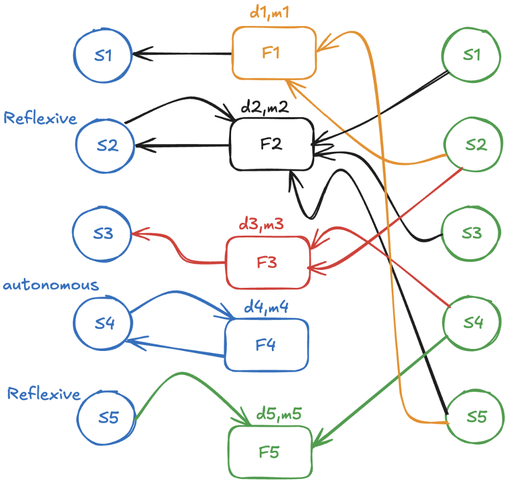

***

The **mizopol** suite currently consists of the following modules that are presented in details through this documentation. 

The presentation below aims at giving a brief and sketchy overview of the tools. 

:::{.callout-important}
The script provided in the sketchy presentation uses the local version of the packages. For a precise and rigorous syntax of the publicly available **API**, refer to the [API-documentation section](api-documentation-intro.qmd) below. 
:::

# `plars`

Identify a sparse multi-variate polynomial[^poly] $P$ such that:
$$y\approx P(x)$$ 

The algorithm is based on a modified, **scalable version** of the `LARS` (least angle) algorithm. 

The `plars` module is detailed [here](plars_intro.qmd).

:::{.small-gray-light}
**M. Alamir**, Nonlinear control of uncertain systems: conventional and data driven alternatives with python. **Springer-Nature**, November, 2025
:::

***

[^poly]: see the [polynomial](polynomials.qmd) page for a rigorous definition.

Notice that `plars` is the fundamental building brick of the whole package in the sense that all the other modules call it at some stage of their execution. 

# `g2sys`

Given sensors $s_1$, ..., $s_n$, 
fit a set of relationships of one of the following two forms: 

:::{.callout-note title='Static'}
$$
s_i(k)=F_i\left(\{s_j(k-\sigma\times d_i)\}_{(j\neq i,\sigma\in \{0,\dots,m_i\})}\right)
$$
 $\rightarrow$ $s_i$ is a static function of the other sensors and their past values up to $m_i\times d_i$.
:::

:::{.callout-note title='Dynamic'}
$$
\bigl[\Delta^{(m_i)} s_i\bigr](k)=F_i\left(\begin{array}
\{s_i(k-\sigma\times d_i)\}_{\sigma\in \{1,\dots,m_i\}}\cr 
\{s_j(k-\sigma\times d_i)\}_{(j\neq i,\sigma\in \{0,\dots,m_i\})}
\end{array}
\right)
$$
$\rightarrow$ The increment $\bigl[\Delta^{(m_i)} s_i\bigr](k)$ represents the discrete version, at instant $k$, of the $m_i$ derivatives of $s_i$.
:::
Can be use to achieve the following tasks: 

- Design **explainable** normality indicators 
- **Discover** unmodelled **relationships**
- Help designing Dynamic **Digital Twins** 
- **Detecting contexts** in the datasets
- Remove **redundant sensors**
- Survey **persistant correlations**

The **g2sys** module is detailed [here](g2sys_intro.qmd)

:::{.panel-tabset}

# Objective

{ style="border: 0px solid #498aa6ff; border-radius: 0px;" }

# Screenshot
{ style="border: 0px solid #498aa6ff; border-radius: 0px;" }
:::

# `pwpol`

Given a set of sensors $s_j$, $j=1,\dots,n_s$ and a target sensor $s_i$, find a set of $n_r$ polynomials $P_\sigma$, $\sigma=1,\dots,n_r$, such that the following residual: 
$$
e_i = \min_{\sigma=1}^{n_r}\Bigl\vert s_i-P_\sigma(\{s_j\}_{j\neq i})\Bigr\vert
$${#eq-residual-implicit}
is small.

Notice that: 

- @eq-residual-implicit defines an **implicit** invariant describing the normality of the system should the dataset on which it is computed be healthy.

- The number $n_r$ of polynomials should be made as small as possible.

- @eq-residual-implicit does not provide a *prediction* capability since the residual can be computed only when the measurement $s_i$ is available. 

The **pwpol** module is detailed [here](pwp_intro.qmd).

{width=100%} 

# `rlars`

Given 

- a features vector $x$ and 
- a label $y$, 

find a set of multi-variate polynomials: 

$$
c_0(x),\dots, c_r(x)
$$

such that $y$ is a root of the following scalar polyomial (in the unknown $z$):

$$
c_r(x)z^r+\dots+c_1(x)z+c_0(x)
$$

More precisely, the following can be viewed as a residual for the normality characterization of the pair $(x,y)$: 

$$
R(x,y):=\sum_{j=0}^rc_j(x)y^j
$${#eq-residualofrlars}

:::{.callout-note title="Rational functions"}
The starting point of this structure is that in the particular case where $r=1$, @eq-residualofrlars simply implies that:
$$
y = -\dfrac{c_0(x)}{c_1(x)}
$$

which is simply a multi-variate fractional expression in the features vector $x$. 

This generalizes the polynomial structure targeted by `plars`. 

Notice however that this is only the starting point, the results obviously offer a much wider generalization than simply fractional representation when $r>1$. 
:::

# Undergoing research

`MizoPol` is a research-steered package. New features and modules are expected to be added continuously as the research goes. 