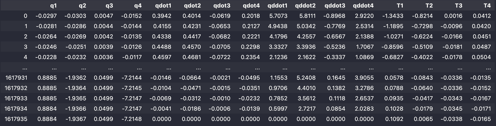
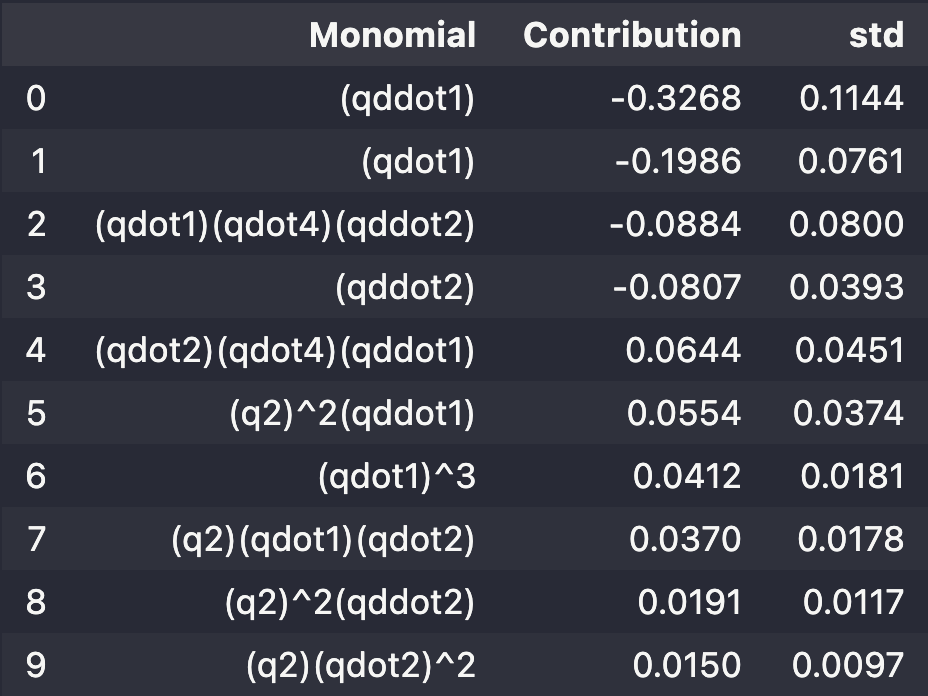
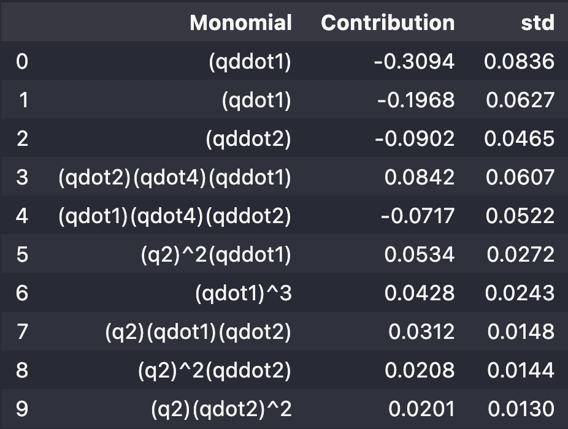

{width="20%" fig-align="left"}


*** 

# Dataset 

We have the following dataframe representing the recording of kinematic variables and the torques at the axis joints:

$$
\{q_i\}_{i=1}^4,\quad \{\dot q_i\}_{i=1}^4, \quad\{\ddot q_i\}_{i=1}^4,\quad \{T_i\}_{i=1}^4
$$
 
of a 4-axis manipulator robot. 




# Problem statement 


:::{.callout-note title="**Regression Problem**"}

Find a sparse polynomial relationship $P$ such that 
$$
T_1 \approx P\bigl(x\bigr)\quad \vert\quad x:= \begin{bmatrix} 
q\cr \dot q\cr \ddot q
\end{bmatrix}\in \mathbb R^{12}
$$
The relationship $P$ should be fitted using only $10\%$ of the data[^withoutshuffle] and tested on the remaining $90\%$ of the data.
:::


# Solution and Results

::: {.panel-tabset}

# Fit on the training dataset

The following script creates an instance of the `PLARS` class and look for a polynomial of degree 3. 

```python 
import numpy as np
from mizopol.plars_api import fit

# call and fit parameters
dic_plars = dict(window=1000, deg=3, nModels=10, nModes=15, eps=1e-2)
dic_plars_fit = dict(compute_contributions=True)

# solve the problem
sol, cpu = fit(X[0:nTrain], y, dic_plars=dic_plars, dic_plars_fit=dic_plars_fit)

print('number of rows in the training data = ', len(ytrain))
print('number of eligible monomials', sol['nfeat'])
print('Number of monomials used = ', sol['card'])
print(f'cpu = {sol["cpu"]:3.4} sec')
```

The printed results are 

```verbatim
number of rows in the training data =  161793
number of eligible parameters 455
Number of monomials used =  101
cpu = 1.756 sec
```

# Evaluate on the test dataset

Now we use the `predict` method of the `PLARS` class in order to computed the torque on the test unseen dataset[^undersampling]. 

```python
from mizopol.plars_api import predict

nJump = 10
ypred, cpu = predict(X[nTrain:], sol)
```


# Results on test data

:::{.callout-important}
[**This solution has been found in less than 2 sec!**]{.smallcaps .large}
:::

<iframe src="html_files/robot4axis.html" width="100%" height="500px" style="border:none;"></iframe>
It is possible to **zoom on the figure** in order to appreciate the quality of the prediction provided by the fitted sparse polynomial.

:::

# Contributions of monomials 

Using the `monomials_contrib` function available in the `plars` module, it is possible to rank the relative contributions of the monomials selected by the solver during the fit process to be incorporated in the solution `sol`.

In the following results these contributions are examined using the train and the test datasets successively. 

:::{.callout-tip title="About the sensitivity results"}
- The similar results in the two datasets suggests the relevance of the estimated contributions. 
- Notice the prevalence of the two most important monotmials are precisely $\ddot q_1$ and $\dot q_1$ which seem relevant given that the targeted label is the torque applied to the fist axis. 
::: 

:::{.panel-tabset}

# Train dataset 

```python 
from mizopol.plars_api import monomials_contrib

df_Contrib = monomials_contrib(df[colXq].iloc[0:nTrain], sol, win=pl.window)

df_Contrib.reset_index(drop=True).iloc[0:10]
```
{width=50% fig-align="left"}

# Test dataset 

```python 
from mizopol.plars_api import monomials_contrib

df_Contrib = monomials_contrib(df[colXq].iloc[nTrain:], sol, win=pl.window)

df_Contrib.reset_index(drop=True).iloc[0:10]
```

{width=50% fig-align="left"}

:::


[^withoutshuffle]: The split should be done without shuffle by using only the first $10\%$ of the data to fit the model. 

[^undersampling]: Only one row each 10 is computed so that the resulting plotly-generated html be *memory-friendly*.