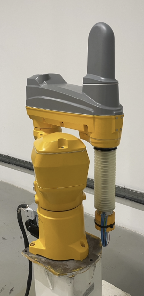
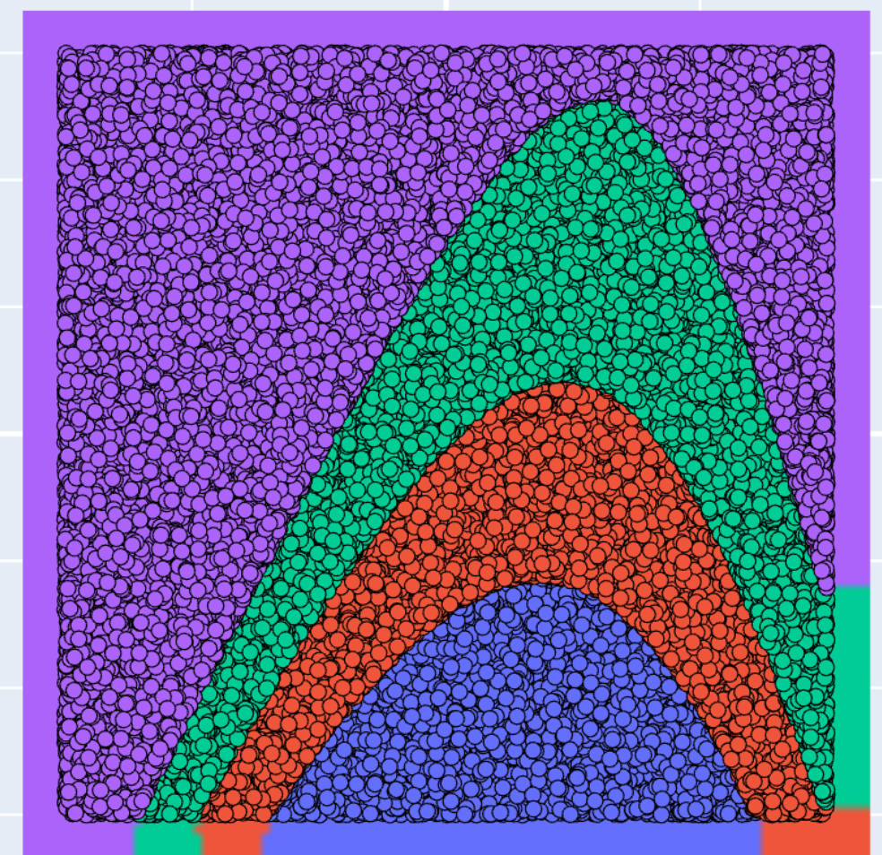

***

The rationale behind the need for **piece-wise polynomial** representation has already be discussed and explained in [piece-wise polynomials section](pwpolynomials.qmd). 

In a nutshell, these relationships enable to handle non purely polynomial dependencies (trigonomic, rational fractions, exponential to cite but few ones), but **more importantly**, they enable to handle multiple context of use where the nature of relationships changes drastically and in a way that is not necessarily indicated in the dataset though context related indicators. 

Searching for piece-wise multi-variate polynomials can be done using the `pwpol` module of the `MizoPol`  package. 

Nothing can be better than specific use-cases studies where instantiations of such circumstances are studied. 

In the present section, we shall consider the following sets of use-cases: 

***

::: {.columns}
::: {.column width=70%}
**The manipulator robot case** 
: Where the precision of the residuals when standard multi-variate relationships are identified by the `pwpol` module and the ones that might be obtained used piece-wise polynomial are compared. This use case illustrate the case where the true relationships are not rigorously polynomials. 

This use-case is detailed in the [robot use-case](pwpol_robot.qmd)
:::

:::{.column width=5%}
 
:::

::: {.column width=25%}
{width=55% fig-align="right"}
:::
::: 

***

::: {.columns}
::: {.column width=70%}
**The anaesthesia dataset**
: Where it is shown how the `pwpol` module can be used to *characterize the normality* over a large number of datasets coming from operation rooms enabling the detection of anomalous events during the surgery depsite the wide class of operations type and medical staff. 

This use-case is detailed in the [anaesthesie use-case](pwpol_anaesthesia.qmd)
:::

:::{.column width=5%}
 
:::

::: {.column width=25%}
{width=100%}
:::
::: 

***

::: {.columns}
::: {.column width=70%}
**The multi-context Kaggle Benchmark dataset**
: Where a publicly available dataset is used to show the ability of the `pwpol` module to define normality and to detect parametric faults that arise only in a specific context of use among others where the context defining variable is not available to the algorithm. 

This use-case is detailed in the [multi-context-banchmark use-case](pwpol_bench.qmd)
:::

:::{.column width=5%}
 
:::

::: {.column width=25%}
{width=100%}
:::
::: 

***

