*** 

::: {.columns}

::: {.column}
This section presents the results obtained when using the `pwpol` modules which identifies piece-wise polynomial invariant to solve the benchmark problem associated to the [KAGGLE dataset](https://www.kaggle.com/datasets/aaf751ada96dd3dc96127af653f1be76d28e61edbb69cfdccf77fe4a43efb68a) that is dedicated to serve as benchmark for parameteric anomaly detection. 

*** 

A full description of this section is also provided in the detailed paper: 

:::{.small-gray-light}
**M. Alamir**, A benchmark for context-dependent parametric anomaly detection in industrial time series. hal-05533907v1
:::
::: 

::: {.column}
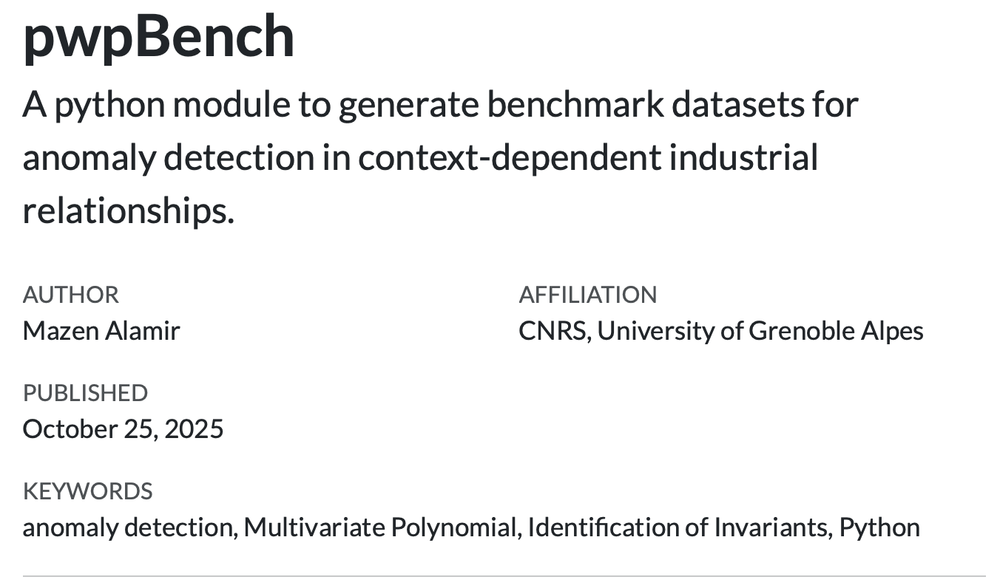
:::
:::

## Parametric anomalies in industrial equipments

By *parameteric anomalies*, it is meant that the anomaly affects a relationship of the form:

$$
F(x,y,p)=0 \quad \text{-- (anomaly) --->}\qquad  F(x,y,p+\delta_p)=0
$${#eq-param-anomaly}

which is a quite frequent (if not the main) form of faults encountered in industrial equipment. The parametric change might be associated to change in the friction coefficients, the braking efficiency coefficient induced by the deterioration of the quality of the surfaces, the coefficient linking the pressure gradient to the flow rate in a valves that is affected by some impurity or changes in the cross section, and the examples are unlimited. 

## The dataset 

The [KAGGLE dataset](https://www.kaggle.com/datasets/aaf751ada96dd3dc96127af653f1be76d28e61edbb69cfdccf77fe4a43efb68a) is built using the freely available python [module `pwpBench`](https://mazenalamir.github.io/pwp_bench/) which enables to generate an infinite number of problems. 

### Industrial specificities
The [KAGGLE dataset](https://www.kaggle.com/datasets/aaf751ada96dd3dc96127af653f1be76d28e61edbb69cfdccf77fe4a43efb68a) is built so that it meets the following specificity of inustrial time series. 

1. Industrial time series obey some underlying (although possibly unknown) generally sparse relationships. These relationships represent physical laws[^polyn].
2.  These relationships might be context-dependent. Moreover, the information regarding the context is commonly absent in the learning data which prevent building context classifiers. 
3.  Many of equipment's anomalies materialize through changes in the parameters that are involved in  the governing parsimonious relationships invoked in the first item above.

4. The representation of the different contexts in the training data is not balanced.  

:::{.callout-tip title="30 different problems in the Kaggle dataset"}
The dataset contains 30 instances of the anomaly detection problem in each of which, several contexts exists with unbalanced presence in the dataset. The default is introduced in a single context in the second half of each dataset.
:::

### Description of a typical problem's dataframe

The Figure below show an examples of the dataframe that is associated to a one of the 30 instances contained in the Kaggle benchmark.

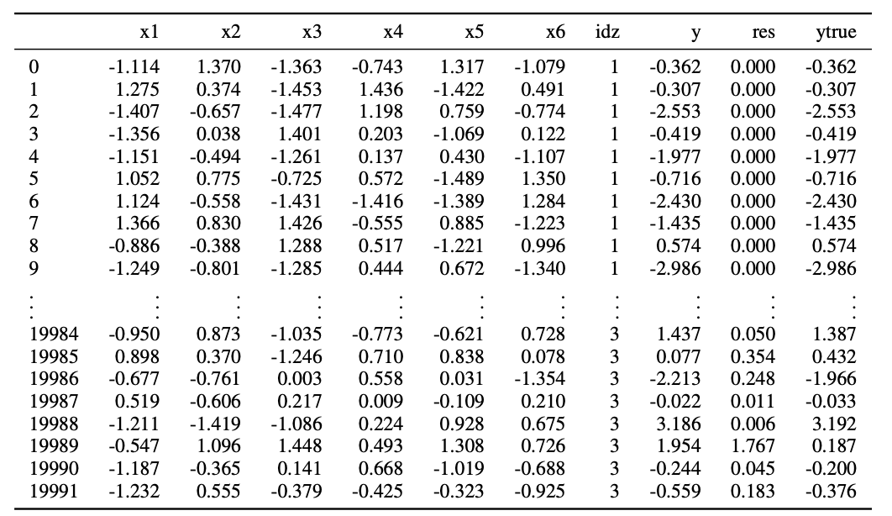{#fig-df}

The columns are: 

- `xi` represents the features (sensors values) whose number range from 2 to 12 (see @fig-statistics)
- `idz` is the context index
- `ytrue` and `y` are the default-free and the detuned value of $y$. This difference is induced by a change in the piece-wise (`idz`-dependent) polynomial serving to compute the label's values. 
- `res` is a redundant column representing the norm of the difference between `y`and `ytrue`.

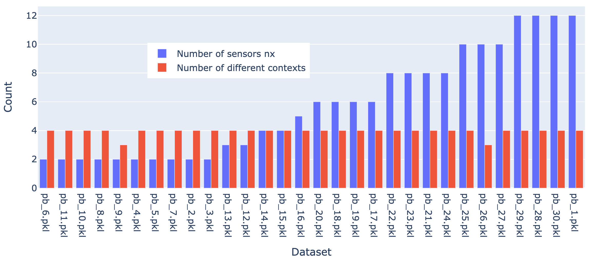{#fig-statistics}

The following Figure shows that kind of differences that one obtains between `y` and `ytrue` which are induced by the parametric detuning of the original relaionships. 

***

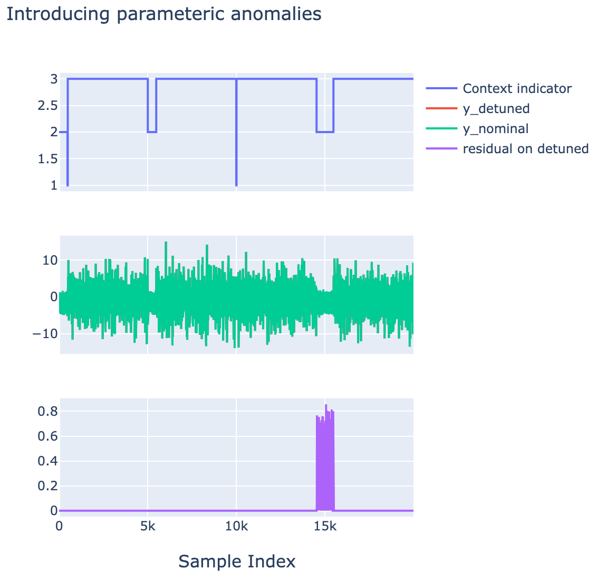{width=48%}
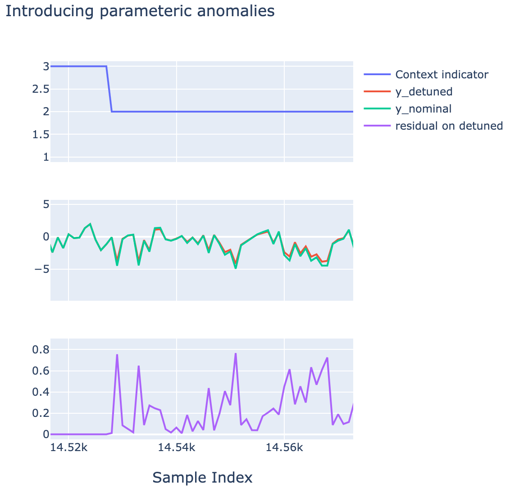{width=48%}

Example of an anomaly introduced in context `idz`=2 in the second half of the dataset.

***

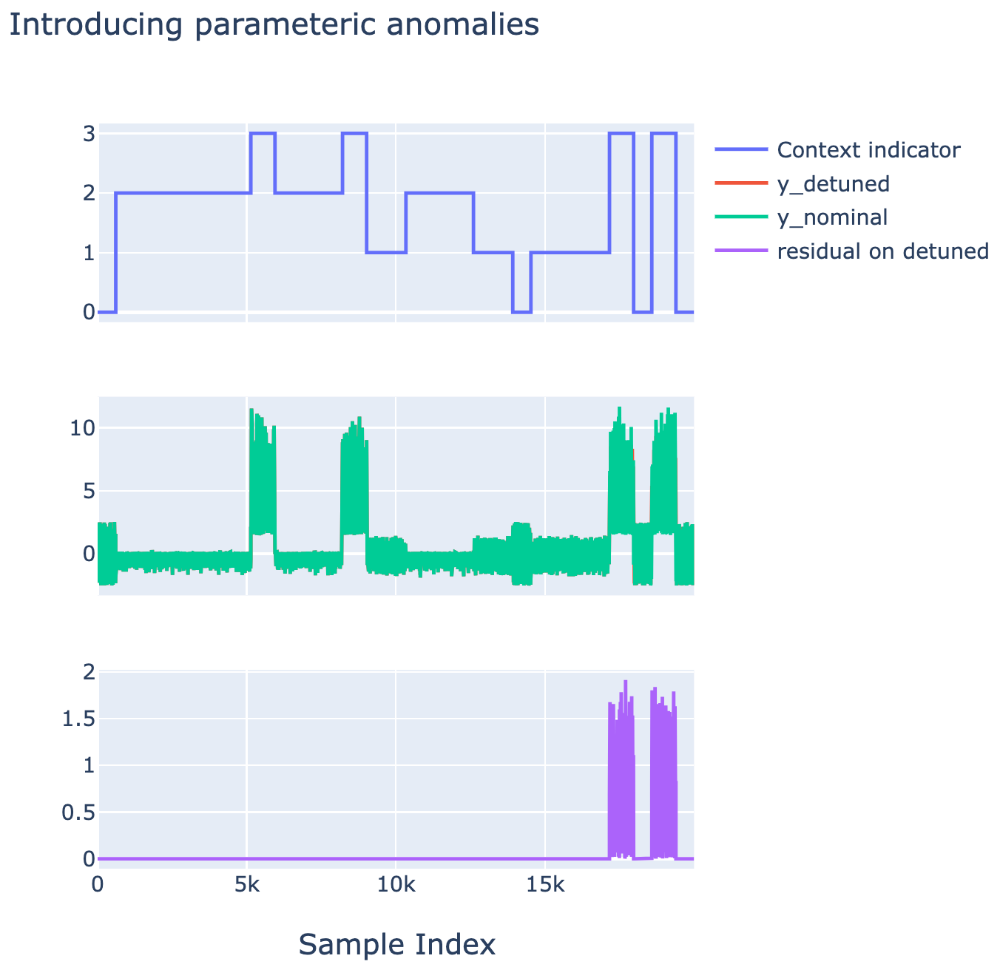{width=48%}
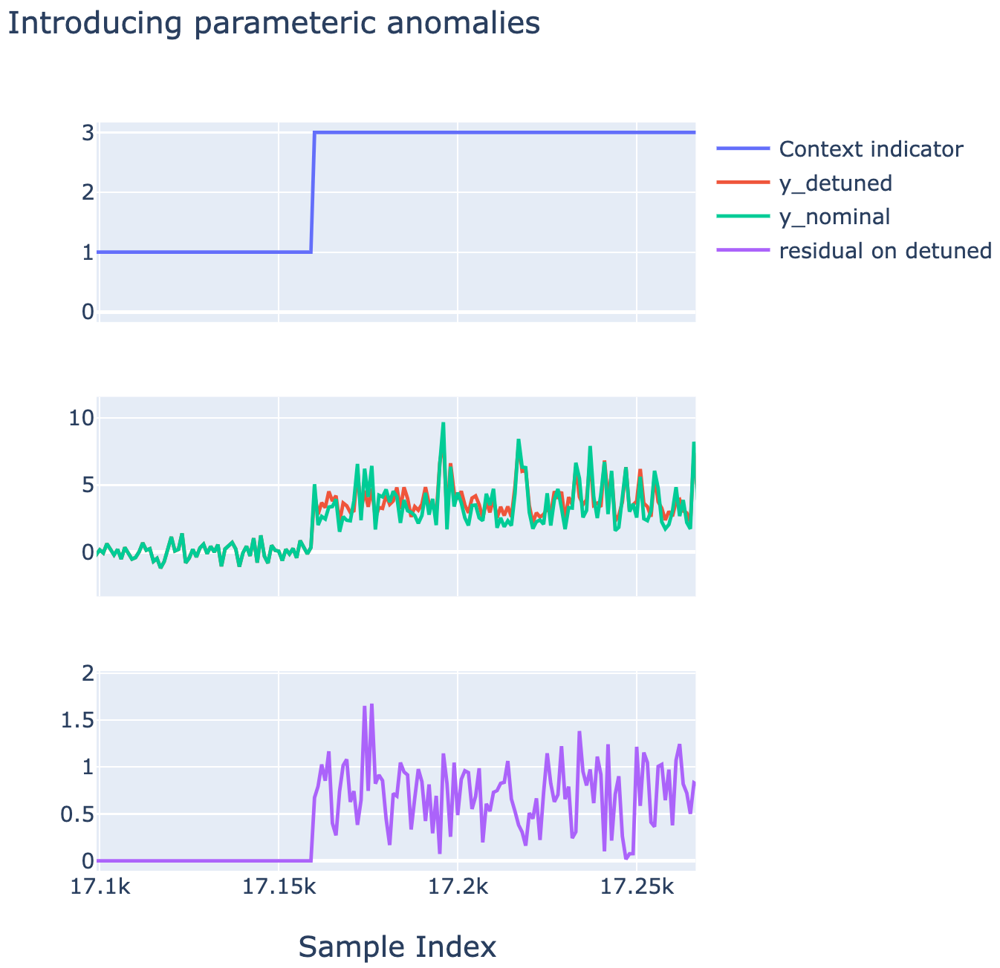{width=48%}

Example of an anomaly introduced in context `idz`=3 in the second half of the dataset.

***

### Example of context-induced partition of the features space

The following figures shows examples of context-dependent region in the features space (here of dimension 2 for the sake of illustration).

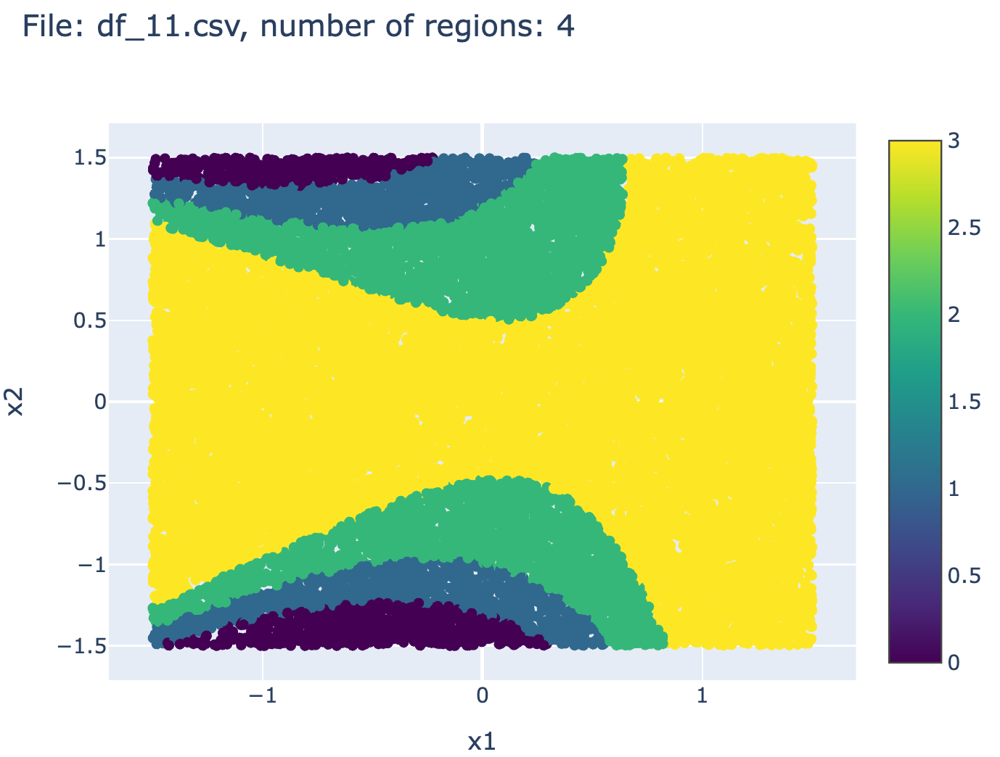{width=32%}
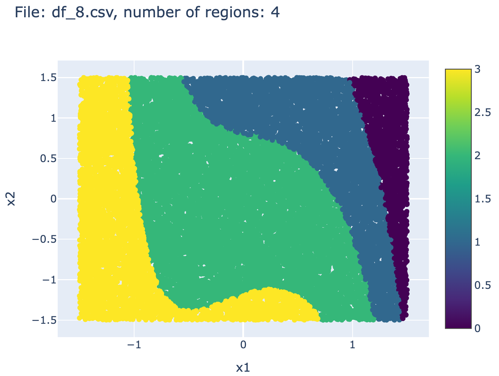{width=32%}
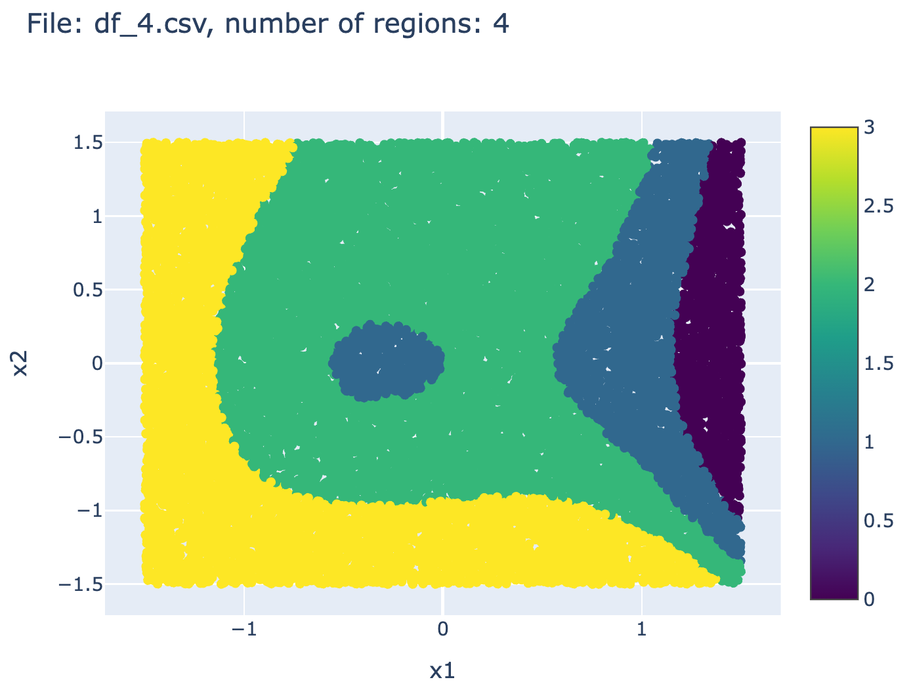{width=32%}

### Normalized version of the dataset 

a normalized version of the benchmark is also investigated. Indeed, in the absence of normalization, it might be possible by investigating the statistical properties of $y$ to create clusters which might be highly correlated to the context index `idz`. In such situations which are not necessarily very frequent, the problem might be  *simplified* by first creating the clusters and then fit a normality model for each of the resulting clusters. 

In order to definitively avoid such potential simplification, it is possible to derive a normalized version of the benchmark in which, the $y$ is normalized within each context so that the amplitudes of $y$ become comparable over the different contexts making the clustering far from being an easy option. 

This is done in the following investigation by dividing the values of $y$ inside each cluster by the value of the 95\% quantile of $\vert y\vert$ inside the cluster in the training subset\footnote{The function that performs the normalization is provided in the documentation of the \texttt{pwp\_bench} package, [(more details on the module's website)](https://mazenalamir.github.io/pwp_bench/). 

The files associated to the resulting datasets are referred to hereafter by:
$$\texttt{pbn\_i.pkl}\qquad i\in \{1,\dots,30\}$$

The Figure below show an example of data before and after normalization 

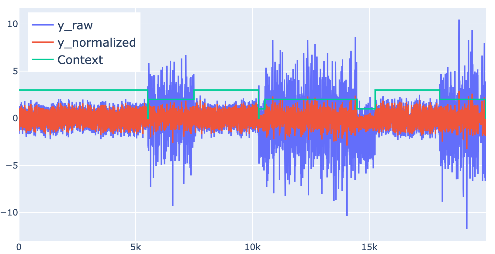

## The anomaly detection problem

The problem can be stated as follows:

:::{.callout-note title="Problem Statement"}
For each dataset associated to one of the files contained in the benchmark, namely:
$$\texttt{pb\_i.pkl}\qquad i\in \{1,\dots,30\}$$
or their normalized versions: 
$$\texttt{pbn\_i.pkl}\qquad i\in \{1,\dots,30\}$$

derive a normality characterization\footnote{Possibly, but not necessarily, using the fact that it is the \texttt{y}-column that is impacted by the introduced parametric anomaly.} using only the columns labelled by: 
$$\texttt{x1},\dots,\texttt{x}_{n_x}, \texttt{y}$$
together with a threshold and use the resulting characterization to detect the anomaly introduced in the second half of each dataset. 
:::

## The `pwpol`-based solution 

### The principle 

A set of precision threshold $\texttt{th}\in \{0.15, 0.2, 0.25, 0.3\}$ is defined. For each dataset, a $\texttt{th}$-associated implicit piece-wise relationship characterizing normality is computed using the `pwpol` module described in [pwpol section](pwp_intro.qmd). This enables to define 4 residual generators: 
$$
R_\texttt{th}(x,y)\quad \texttt{th}\in \{0.15, 0.2, 0.25, 0.3\}
$$

which hence enables to define a Bagging-solution (averaging over the four *voters*). The results is also averaging over a rolling window in order to come out with a chaterring-free decision. 

### The results

First of all the following @fig-card shows the cardinality and the computation times of the implicit relationships obtained for the different values of the precision threshold $\texttt{th}$ mentioned above. The results are shown for the raw (non normalized data). The case of normalized data leads to comparable order of magnitude in terms of cardinality and computation times. 

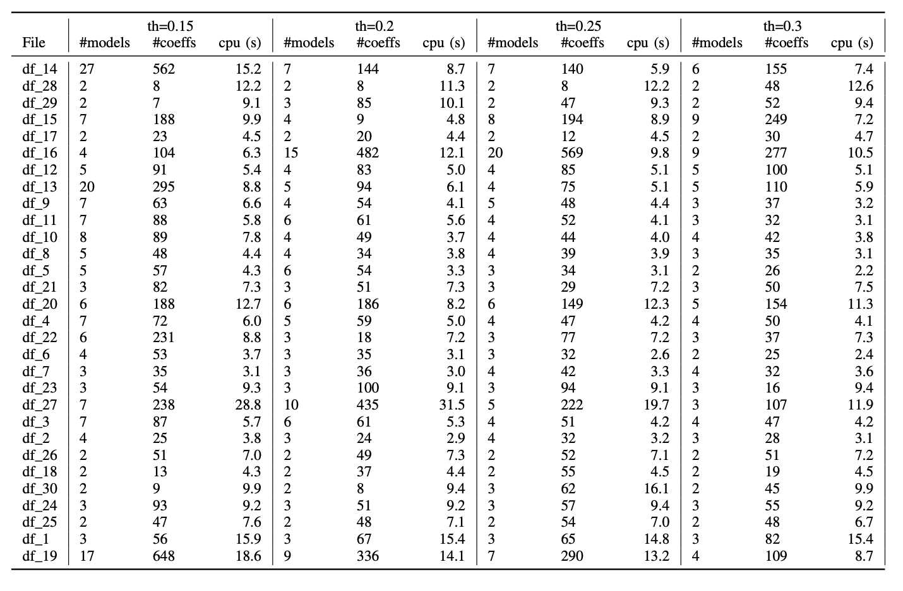{#fig-card}

The detection and false alarm statistics for the Bagging solution is shown in @fig-DR below:

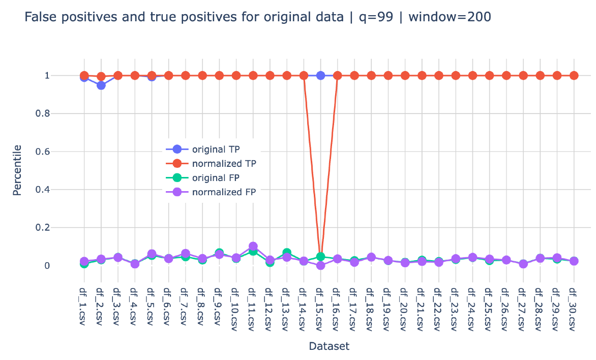{#fig-DR}

As for the individual statistics for each of the individual $\texttt{th}$-related solutions, they are shown in the figures below where it can be observed that no more than 4 datasets show rather bad detection rates. It can also be observed that generally, when one individual solution does not detect an anomaly, the other three solutions manage to detect it which explain the impressive statistics of the bagging-based solution. 

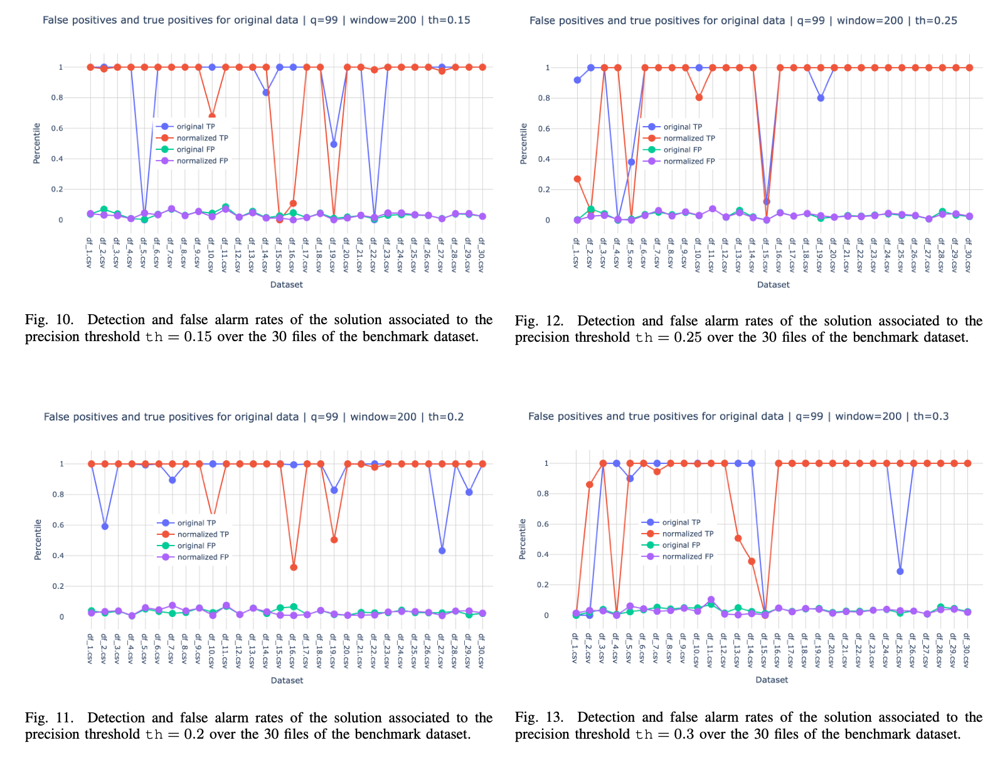

[^polyn]: The relationships used in the benchmark are piece-wise polynomial ones. 

